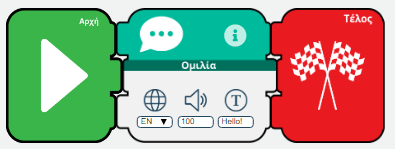
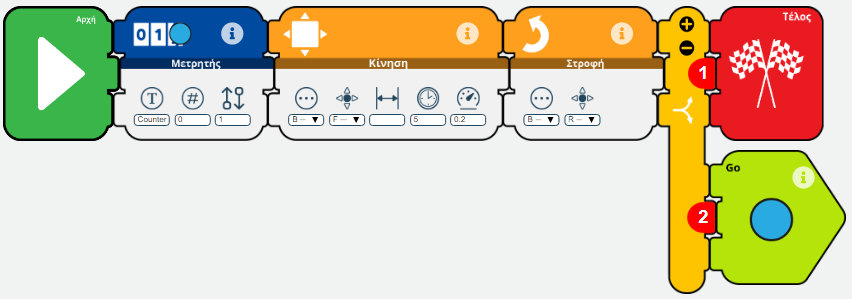
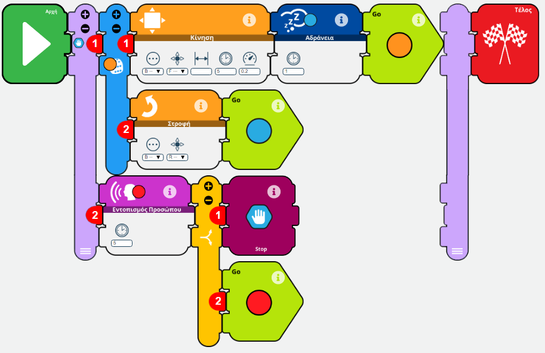

## Simple talk application



```python
#!/usr/bin/python
# -*- coding: utf-8 -*-
import sys
import os
import logging

from r4a_apis.utilities import *
from r4a_apis.tek_nodes import *

from r4a_apis.robot_api import RobotAPI
from r4a_apis.cloud_api import CloudAPI
from r4a_apis.generic_api import GenericAPI

try:
	log = Logger(allow_cutelog = False, level = logging.INFO)
	TekNode.logger = log
	TekNode.robot_api = RobotAPI(logger = log)
	TekNode.cloud_api = CloudAPI(memory = TekNode.robot_api.memory, logger = log)
	TekNode.generic_api = GenericAPI(memory = TekNode.robot_api.memory, logger = log)
	Condition.memory = TekNode.robot_api.memory
	Condition.logger = log
	InputMessage.logger = log
	OutputMessage.logger = log
	TekException.logger = log
	NodeExecutor.logger = log
	log.debug('main', "Hey, app is starting")

	nodes = {}
	nodes[0] = StartTekNode(0)
	nodes[1] = TalkTekNode(1)
	nodes[1].setParameters(language = Languages.EN, texts = ["Hello!"], volume = 100)
	nodes[2] = StopTekNode(2)

	# Conditions


	# Transitions
	nodes[0].setNextNode(id = 1)
	nodes[1].setNextNode(id = 2)

	# Thread executors

	# Main execution
	main_executor = NodeExecutor(exe_id = 0)
	main_executor.addNode(id = 0, node = nodes[0])
	main_executor.addNode(id = 1, node = nodes[1])
	main_executor.addNode(id = 2, node = nodes[2])
	main_executor.setStartingNode(id = 0)

	# Go for it
	main_executor.execute()

except TekException:
	pass
```

## Draw a rectangle



```python
#!/usr/bin/python
# -*- coding: utf-8 -*-
import sys
import os
import logging

from r4a_apis.utilities import *
from r4a_apis.tek_nodes import *

from r4a_apis.robot_api import RobotAPI
from r4a_apis.cloud_api import CloudAPI
from r4a_apis.generic_api import GenericAPI

try:
	log = Logger(allow_cutelog = False, level = logging.INFO)
	TekNode.logger = log
	TekNode.robot_api = RobotAPI(logger = log)
	TekNode.cloud_api = CloudAPI(memory = TekNode.robot_api.memory, logger = log)
	TekNode.generic_api = GenericAPI(memory = TekNode.robot_api.memory, logger = log)
	Condition.memory = TekNode.robot_api.memory
	Condition.logger = log
	InputMessage.logger = log
	OutputMessage.logger = log
	TekException.logger = log
	NodeExecutor.logger = log
	log.debug('main', "Hey, app is starting")

	nodes = {}
	nodes[0] = StartTekNode(0)
	nodes[2] = StopTekNode(2)
	nodes[3] = RobotMotionTekNode(3)
	nodes[3].setParameters(distance = None, duration = 5.0, direction = Directions.FORWARDS, speed = 0.2, type = MotionType.BASIC)
	nodes[4] = CounterTekNode(4)
	nodes[4].setParameters(name = "Counter", set_value = 0, change_by = 1)
	nodes[5] = RobotTurnTekNode(5)
	nodes[5].setParameters(type = MotionType.BASIC, direction = Directions.RIGHT)
	nodes[6] = TransitionTekNode(6)
	nodes[7] = TransitionTekNode(7)

	# Conditions
	cg62 = ConditionGroup(type = LogicalOperators.AND)

	condition_cg62  = Condition (
		left_operant = "Counter",
		left_index = 0,
		left_op_type = OperantTypes.COUNTER,
		operator = RelationalOperators.EQUAL,
		right_operant = 4.0,
		right_index = 0
	)

	cg62.addCondition(condition_cg62)

	cg67 = ConditionGroup(type = LogicalOperators.AND)

	condition_cg67  = Condition (
		left_operant = "Counter",
		left_index = 0,
		left_op_type = OperantTypes.COUNTER,
		operator = RelationalOperators.NOT_EQUAL,
		right_operant = 4.0,
		right_index = 0
	)

	cg67.addCondition(condition_cg67)


	# Transitions
	nodes[0].setNextNode(id = 4)
	nodes[3].setNextNode(id = 5)
	nodes[4].setNextNode(id = 3)
	nodes[5].setNextNode(id = 6)
	nodes[6].setNextNode(id = 2, condition = cg62)
	nodes[6].setNextNode(id = 7, condition = cg67)
	nodes[7].setNextNode(id = 4)

	# Thread executors

	# Main execution
	main_executor = NodeExecutor(exe_id = 0)
	main_executor.addNode(id = 0, node = nodes[0])
	main_executor.addNode(id = 2, node = nodes[2])
	main_executor.addNode(id = 3, node = nodes[3])
	main_executor.addNode(id = 4, node = nodes[4])
	main_executor.addNode(id = 5, node = nodes[5])
	main_executor.addNode(id = 6, node = nodes[6])
	main_executor.addNode(id = 7, node = nodes[7])
	main_executor.setStartingNode(id = 0)

	# Go for it
	main_executor.execute()

except TekException:
	pass
```

## Search for face and randomly move in parallel



```python
#!/usr/bin/python
# -*- coding: utf-8 -*-
import sys
import os
import logging

from r4a_apis.utilities import *
from r4a_apis.tek_nodes import *

from r4a_apis.robot_api import RobotAPI
from r4a_apis.cloud_api import CloudAPI
from r4a_apis.generic_api import GenericAPI

try:
	log = Logger(allow_cutelog = False, level = logging.INFO)
	TekNode.logger = log
	TekNode.robot_api = RobotAPI(logger = log)
	TekNode.cloud_api = CloudAPI(memory = TekNode.robot_api.memory, logger = log)
	TekNode.generic_api = GenericAPI(memory = TekNode.robot_api.memory, logger = log)
	Condition.memory = TekNode.robot_api.memory
	Condition.logger = log
	InputMessage.logger = log
	OutputMessage.logger = log
	TekException.logger = log
	NodeExecutor.logger = log
	log.debug('main', "Hey, app is starting")

	nodes = {}
	nodes[0] = StartTekNode(0)
	nodes[1] = ThreadsTekNode(1)
	nodes[3] = DiceTekNode(3)
	nodes[4] = RobotMotionTekNode(4)
	nodes[4].setParameters(distance = None, duration = 5.0, direction = Directions.FORWARDS, speed = 0.2, type = MotionType.BASIC)
	nodes[5] = RobotTurnTekNode(5)
	nodes[5].setParameters(type = MotionType.BASIC, direction = Directions.RIGHT)
	nodes[6] = SleepTekNode(6)
	nodes[6].setParameters(duration = 1.0)
	nodes[7] = TransitionTekNode(7)
	nodes[8] = TransitionTekNode(8)
	nodes[9] = DetectFaceTekNode(9)
	nodes[9].setParameters(duration = 5.0)
	nodes[10] = TransitionTekNode(10)
	nodes[11] = TransitionTekNode(11)
	nodes[12] = PreemptorTekNode(12)
	nodes[12].setParameters(preempt_executors = [3])
	nodes[13] = StopTekNode(13)

	# Conditions
	cg1012 = ConditionGroup(type = LogicalOperators.AND)

	condition_cg1012  = Condition (
		left_operant = TekVariables.DETECT_FACE_DETECTED,
		left_index = 0,
		operator = RelationalOperators.EQUAL,
		right_operant = True,
		right_index = 0
	)

	cg1012.addCondition(condition_cg1012)

	cg1011 = ConditionGroup(type = LogicalOperators.AND)

	condition_cg1011  = Condition (
		left_operant = TekVariables.DETECT_FACE_DETECTED,
		left_index = 0,
		operator = RelationalOperators.EQUAL,
		right_operant = False,
		right_index = 0
	)

	cg1011.addCondition(condition_cg1011)


	# Transitions
	nodes[0].setNextNode(id = 1)
	nodes[1].setNextNode(id = 13)
	nodes[3].setNextNodeProbabilistic(id = 4, weight = 50.0)
	nodes[3].setNextNodeProbabilistic(id = 5, weight = 50.0)
	nodes[4].setNextNode(id = 6)
	nodes[5].setNextNode(id = 7)
	nodes[6].setNextNode(id = 8)
	nodes[7].setNextNode(id = 6)
	nodes[8].setNextNode(id = 3)
	nodes[9].setNextNode(id = 10)
	nodes[10].setNextNode(id = 12, condition = cg1012)
	nodes[10].setNextNode(id = 11, condition = cg1011)
	nodes[11].setNextNode(id = 9)

	# Thread executors
	executors_th_1 = {}

	executors_th_1[3] = NodeExecutor(exe_id = 3)
	executors_th_1[3].addNode(id = 3, node = nodes[3])
	executors_th_1[3].addNode(id = 4, node = nodes[4])
	executors_th_1[3].addNode(id = 6, node = nodes[6])
	executors_th_1[3].addNode(id = 8, node = nodes[8])
	executors_th_1[3].addNode(id = 5, node = nodes[5])
	executors_th_1[3].addNode(id = 7, node = nodes[7])
	executors_th_1[3].setStartingNode(id = 3)
	executors_th_1[9] = NodeExecutor(exe_id = 9)
	executors_th_1[9].addNode(id = 9, node = nodes[9])
	executors_th_1[9].addNode(id = 10, node = nodes[10])
	executors_th_1[9].addNode(id = 12, node = nodes[12])
	executors_th_1[9].addNode(id = 11, node = nodes[11])
	executors_th_1[9].setStartingNode(id = 9)

	nodes[1].setParameters(executors = executors_th_1)

	# Main execution
	main_executor = NodeExecutor(exe_id = 0)
	main_executor.addNode(id = 0, node = nodes[0])
	main_executor.addNode(id = 1, node = nodes[1])
	main_executor.addNode(id = 13, node = nodes[13])
	main_executor.setStartingNode(id = 0)

	# Go for it
	main_executor.execute()

except TekException:
	pass
```
